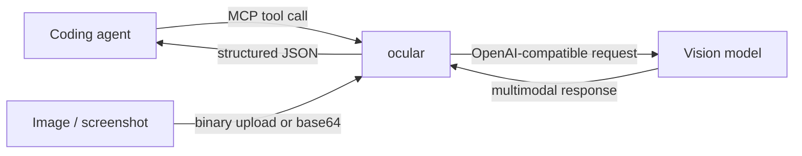

# ocular

[](https://github.com/xyun1996/ocular/actions/workflows/ci.yml)
[](LICENSE)
[](https://nodejs.org/)
[](https://www.typescriptlang.org/)
[](https://modelcontextprotocol.io/)

**Vision for coding agents.**

`ocular` is an MCP server that lets text-first coding agents analyze screenshots, UI mockups, terminal errors, documents, tables, and charts through OpenAI-compatible vision models.

It is designed for both local stdio use and remote HTTP deployments. For remote agents, image bytes can travel through a binary upload side channel while MCP tool calls carry only a lightweight `file_id`, avoiding large inline base64 payloads.

> **Project status:** early-stage and actively evolving. Feedback, bug reports, integrations, and real-world usage reports are welcome.

## Why ocular?

Coding agents are good at reading source code but often lose context when the important evidence is visual: a broken layout, a terminal screenshot, an error dialog, a chart, or a design reference.

`ocular` turns those visual inputs into structured data an agent can reason about.

- **Agent-oriented output** — tools return structured JSON instead of prose-only descriptions.
- **8 focused vision tools** — general analysis, OCR, UI inspection, error diagnosis, UI comparison, table extraction, chart analysis, and upload orchestration.
- **OpenAI-compatible providers** — use OpenAI, Azure-compatible endpoints, SiliconFlow, Ollama, vLLM, and other compatible services.
- **Remote-friendly uploads** — binary `PUT /upload` flow for large images with content-addressed `file_id` references.
- **Local or remote MCP** — stdio for local clients, HTTP for hosted/private deployments.
- **Caching and persistence** — deduplicated uploads plus result caching for repeated agent workflows.

## How it works



For remote HTTP deployments, the recommended path is:

```text
image bytes -> PUT /upload -> file_id -> MCP vision tool -> structured result
```

See [Architecture](docs/architecture.md) for the upload and caching model.

## Demo

Want to see the full handoff from screenshot to coding-agent evidence? Read the [end-to-end demo](docs/demo.md).

It walks through a remote image upload, a `diagnose_error_screenshot` call, the structured fields returned to the agent, and how that evidence is combined with repository context. Example model output is explicitly marked representative rather than presented as a benchmark.

## Quick start

### 1. Build from source

```bash
git clone https://github.com/xyun1996/ocular.git
cd ocular
npm install
npm run build
```

### 2. Configure a vision provider

```bash
cp .env.example .env
```

Minimal OpenAI-compatible configuration:

```env
OCULAR_BASE_URL=https://api.openai.com/v1
OCULAR_API_KEY=your_api_key
OCULAR_MODEL=gpt-4o-mini
```

A local OpenAI-compatible endpoint also works:

```env
OCULAR_BASE_URL=http://localhost:11434/v1
OCULAR_API_KEY=ollama
OCULAR_MODEL=qwen2.5-vl-7b
```

### 3. Run in stdio mode

```bash
node dist/index.js
```

### 4. Connect an MCP client

Claude Code example:

```bash
claude mcp add ocular -- node /absolute/path/to/ocular/dist/index.js
```

For a generic MCP client:

```json
{
  "mcpServers": {
    "ocular": {
      "command": "node",
      "args": ["/absolute/path/to/ocular/dist/index.js"],
      "env": {
        "OCULAR_BASE_URL": "https://api.openai.com/v1",
        "OCULAR_MODEL": "gpt-4o-mini",
        "OCULAR_API_KEY": "your_api_key"
      }
    }
  }
}
```

See [Claude Code setup](examples/claude-code.md) for a fuller walkthrough.

## Example workflows

### Diagnose a screenshot

Ask your coding agent to inspect an error screenshot and extract the exact message, likely cause, and next checks.

```json
{
  "file_id": "e21ba723...",
  "task": "Extract the exact error and suggest the next debugging checks",
  "project_context": "Node.js TypeScript project"
}
```

### Review a UI implementation

Use `analyze_ui_screenshot` to turn a screenshot into implementation-oriented observations about hierarchy, alignment, spacing, typography, contrast, and likely visual defects.

### Compare expected vs actual UI

Use `compare_ui_screenshots` with a reference screenshot and an implementation screenshot to identify regressions and layout differences.

See [Screenshot debugging example](examples/screenshot-debugging.md).

## Tools

| Tool | Purpose |
|---|---|
| `analyze_image` | General structured image analysis |
| `extract_text_from_image` | OCR with reading-order/layout awareness |
| `analyze_ui_screenshot` | UI hierarchy, spacing, typography and accessibility review |
| `diagnose_error_screenshot` | Extract and diagnose terminal/browser/build errors |
| `compare_ui_screenshots` | Compare reference and implementation screenshots |
| `extract_table_from_image` | Extract table data into structured output |
| `analyze_chart_image` | Analyze chart labels, values, trends and uncertainty |
| `create_upload_session` | Return upload endpoint and instructions for remote clients |

Every vision tool accepts `file_id`; local workflows can also use inline `image_base64` where appropriate.

## Remote deployment

Set HTTP transport and authentication:

```env
MCP_TRANSPORT=http
MCP_HTTP_HOST=127.0.0.1
MCP_HTTP_PORT=3000
MCP_HTTP_PATH=/mcp
MCP_AUTH_TOKEN=replace_with_a_long_random_token
MCP_AUTH_HEADER=authorization
MCP_AUTH_SCHEME=Bearer
```

Upload raw bytes:

```bash
curl --request PUT \
  --data-binary @/path/to/image.png \
  "https://your.host/upload" \
  -H "Content-Type: image/png" \
  -H "Authorization: Bearer your_mcp_auth_token"
```

The server returns a content-addressed `file_id`; pass that id to a vision tool instead of sending a large base64 string through MCP.

For reverse proxy and systemd examples, see [Deployment](docs/deployment.md).

## Configuration

Common variables:

| Variable | Purpose |
|---|---|
| `OCULAR_BASE_URL` | OpenAI-compatible API base URL |
| `OCULAR_API_KEY` | Provider API key |
| `OCULAR_MODEL` | Vision-capable model name |
| `OCULAR_HEADERS` | Optional custom provider headers as JSON |
| `OCULAR_TEMPERATURE` | Generation temperature |
| `OCULAR_MAX_TOKENS` | Maximum generated tokens |
| `OCULAR_TIMEOUT_MS` | Provider timeout |
| `OCULAR_MAX_IMAGE_MB` | Maximum image size |
| `OCULAR_CACHE_ENABLED` | Enable result cache |
| `OCULAR_CACHE_DIR` | Cache directory |
| `OCULAR_UPLOADS_DIR` | Persistent upload directory |
| `OCULAR_UPLOAD_URL_BASE` | Public base URL used in upload instructions |

See [.env.example](.env.example) for the full configuration surface.

## Development

```bash
npm install
npm run build
npm test
npm run check
npm run dev
```

The repository includes tests for authentication, caching, image handling, MCP server behavior, provider payloads, and tool execution.

## Security and privacy

Do not commit provider API keys or MCP authentication tokens. Public HTTP deployments should sit behind HTTPS and a reverse proxy; the Node process should generally bind to a private interface.

See [SECURITY.md](SECURITY.md) for vulnerability reporting guidance.

## Roadmap

Near-term areas where contributions are useful:

- More real-world MCP client integration examples
- Additional provider compatibility testing
- More fixture-based tests for visual workflows
- Better packaging and release automation
- Usage/latency benchmarks across vision models
- Community-driven tool and prompt improvements

If you are using `ocular` in a real workflow, opening an issue describing the client, provider, and use case is especially useful — even when nothing is broken.

## Contributing

Contributions are welcome. Start with [CONTRIBUTING.md](CONTRIBUTING.md), run `npm run check` before opening a PR, and include reproduction details for behavior changes.

## License

MIT — see [LICENSE](LICENSE).

If `ocular` is useful in your agent workflow, a GitHub star helps other developers discover the project.
