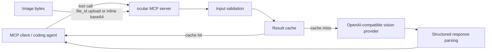

# Architecture

`ocular` is an MCP server that converts visual inputs into structured data for coding agents.

## Data flow



## Local stdio mode

For a local MCP client, `ocular` runs as a child process and communicates over stdio. Small images can be supplied inline as base64 because the client and server are on the same machine and no separate HTTP upload service is required.

## Remote HTTP mode

For remote deployments, `ocular` exposes the MCP endpoint and a binary upload endpoint.

Recommended flow:

1. The client sends raw image bytes with `PUT /upload`.
2. The upload store validates the declared MIME type against the image signature.
3. The server hashes the image content and returns a `file_id`.
4. The MCP tool call references that `file_id` instead of embedding the full image payload.
5. `ocular` loads the image and sends it to the configured vision provider.
6. The tool returns structured JSON to the agent.

This keeps large binary data outside the MCP JSON parameter path and makes remote uploads reusable across calls.

## Content-addressed uploads

The current upload identifier is derived from the image content. Identical bytes produce the same id, allowing duplicate uploads to reuse the stored file.

Uploaded files are stored under `OCULAR_UPLOADS_DIR`. Metadata is reconciled with the upload directory when the service starts so persisted uploads can survive process restarts.

## Result caching

When enabled, results are cached using inputs that include the image identity, tool, task, model, and prompt version. Repeating the same request can therefore avoid another provider call.

Cache behavior is configured with:

```env
OCULAR_CACHE_ENABLED=true
OCULAR_CACHE_DIR=.ocular-cache
```

## Provider boundary

`ocular` talks to OpenAI-compatible chat-completions endpoints. Provider-specific credentials and model names remain configuration, rather than being hard-coded into tool implementations.

Typical configuration:

```env
OCULAR_BASE_URL=https://api.openai.com/v1
OCULAR_API_KEY=your_api_key
OCULAR_MODEL=gpt-4o-mini
```

Local OpenAI-compatible servers can be used the same way.

## Security boundary

HTTP mode requires MCP authentication. Public deployments should terminate TLS at a reverse proxy and keep the Node process bound to a private/local interface where possible.

Provider API keys, MCP auth tokens, and image payloads should not be written to application logs. See [`SECURITY.md`](../SECURITY.md) for reporting guidance and [`deployment.md`](deployment.md) for deployment examples.
